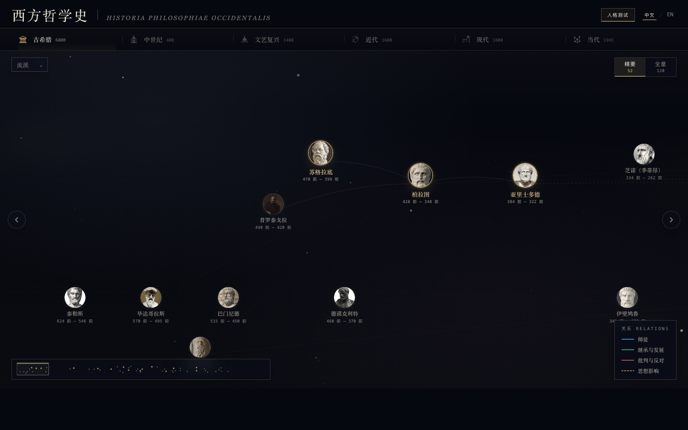

# 西方哲学史 · Philosophy History

一个以时间轴、星图关系和哲学人格测试为核心的西方哲学史互动网站。

[在线访问 GitHub Pages](https://chen7xin-afk.github.io/Philosophy-History/)

## Features

- 哲学家时间星图：按时代、流派与关系浏览西方哲学史。
- 精要 / 全量模式：快速查看核心哲学家，或展开完整图谱。
- 哲学家详情页：查看生平、核心思想、代表作和名言。
- 哲学人格测试：完成 12 道题，生成 16 种哲学人格之一。
- 分享海报导出：生成适合社交平台分享的竖版 PNG 图片。

## Live Site

https://chen7xin-afk.github.io/Philosophy-History/
